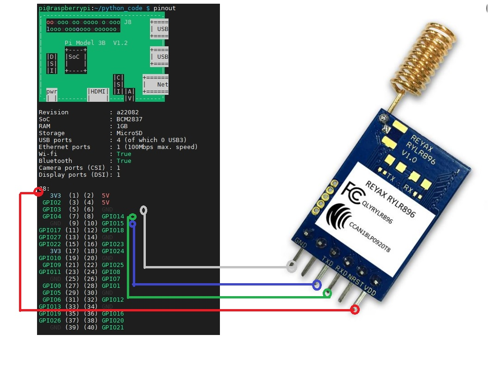
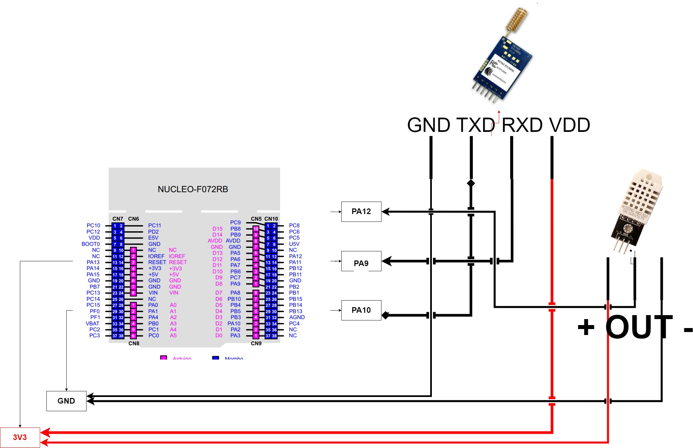
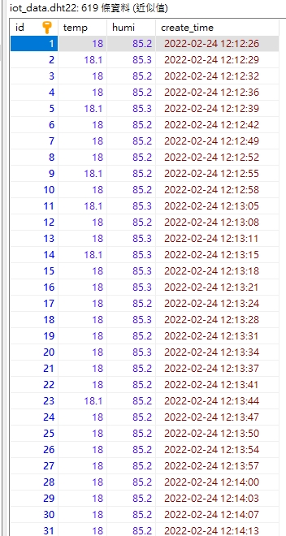
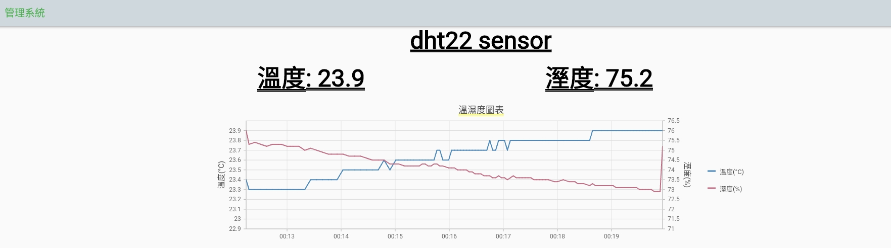

# raspberry-iot-rola-dht22
# 說明
## 使用raspberry-pi 3 當作接Rola收端接收溫度資料並存到mysql裡

# pi接線圖

REYAX896
- VDD -> 3V3
- RXD -> GPIO14
- TXD -> GPIO15
- GND -> GND
# STM32接線圖

REYAX896
- VDD -> 3V3
- RXD -> PA9
- TXD -> PA10
- GND -> GND

DHT22
- VDD -> 3V3
- OUT -> PA12
- GND -> GND

# 開發環境-流程
## 1,nodejs server build
### output server/dist
```
cd server
```
```
npm run tsc
```
## 2,flutter web app build
### output app/build/web
```
cd app
```
```
flutter build web
```
## 3, docker-compose build
### 把整個專案資料夾複製到raspi裡，前兩步raspi裡執行比較慢，故先在pc上處理
```
sudo sh ./docker_run.sh up
```
## 3, 瀏覽器 上輸入 http://raspberrypi:8081
### 如果是新安裝的raspi hostname 預設為 raspberrypi

## docker內 apt-update 指令錯誤處理
cd /tmp;wget http://ftp.debian.org/debian/pool/main/libs/libseccomp/libseccomp2_2.5.3-2_armhf.deb;sudo dpkg -i libseccomp2_2.5.3-2_armhf.deb

# 成果

[](./doc/app_result.mp4)